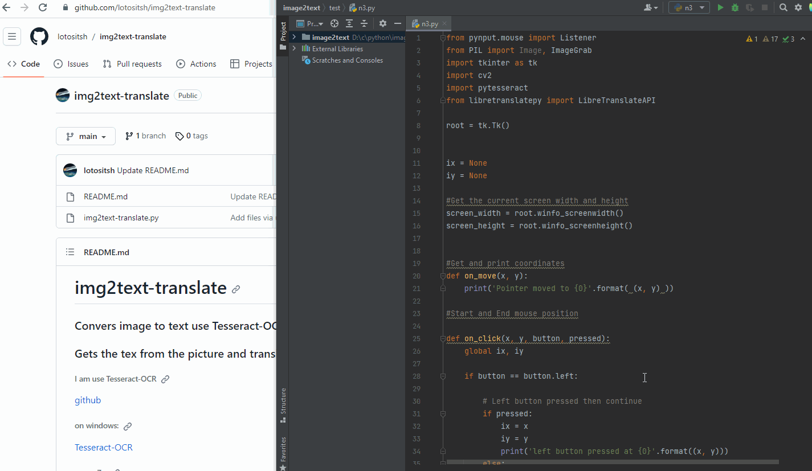

# img2text-translate
### Convers image to text use Tesseract-OCR and translate use EN to RU use LibreTranslate
### Gets the tex from the picture and translates it
###### I am use Tesseract-OCR 
[github](https://github.com/tesseract-ocr/tesseract/)
###### on windows:
[Tesseract-OCR](https://tesseract-ocr.github.io/tessdoc/Downloads.html)
###### or my 7z:
[Tesseract-OCR-windows-my-us](https://drive.proton.me/urls/18AG9M3HB4#DUqrPnE0B1Bw)
###### Add LANG to Tesseract:
[LANG](https://github.com/tesseract-ocr/tessdata)

###### Change to you translate and PATH:

```python
pytesseract.pytesseract.tesseract_cmd = r'Tesseract-OCR\\tesseract.exe'
text = pytesseract.image_to_string(img, lang="eng")
```

Although the outline is not visible, but it is there, use your imagination. It is best to trace the text diagonally. If anyone can resolve this, let me know

Use hotkey AHK CTRL+Z and kill process after loop run
```ahk
^z::
if (processExist("n3.exe")) {
    Process, Close, n3.exe
    Sleep, 1000
}
Run, n3.exe

processExist(processName) {
    Process, Exist, % processName
    return Errorlevel
}
```

